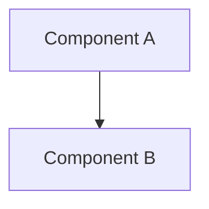
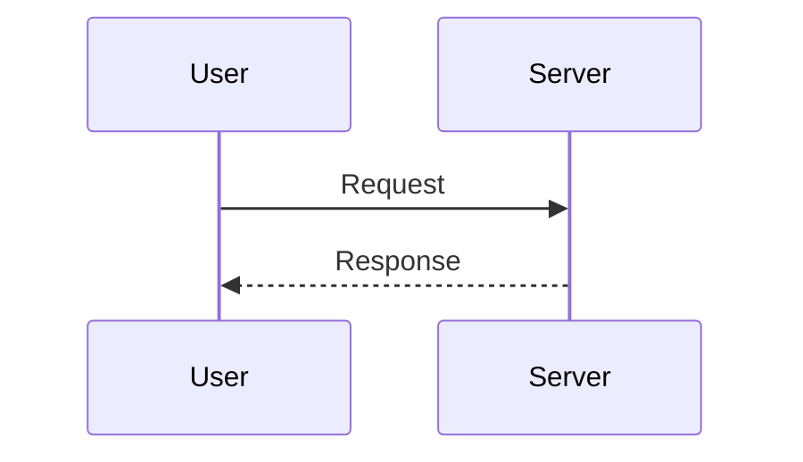

# Module Detailed Design Template (Type 3)

> **Copy to use**: `cp templates/3_module-detailed-design.md detailed-design/<module-name>.md`
> Recommended location: `detailed-design/`
> Reference: [Google Design Doc (Industrial Empathy)](https://www.industrialempathy.com/posts/design-docs-at-google/) + [Pragmatic Engineer RFC](https://blog.pragmaticengineer.com/rfcs-and-architecture-decision-records/) + arc42 §5 Building Block View
> Length target: **5–20 pages**
>
> **Mandatory sections** (per industry survey):
> - **Non-Goals** (Google's most common reason for rejecting design docs)
> - **Alternatives Considered** (in 80%+ of templates; preserves "why this option" knowledge for future readers)
>
> Delete this `> ...` guidance block after copying.

---

# <Module name>

| Metadata     | Value                                              |
| ------------ | -------------------------------------------------- |
| Version      | 1.0.0                                              |
| Status       | Spec-Only / In Progress / Implemented              |
| Type         | Module Detailed Design (Type 3 / arc42 §5)         |
| Owner        | <name>                                             |
| Source code  | `path/to/source/`                                  |
| Related PRD  | [<feature-name>_PRD](../arc42/03-context-and-scope/prds/<file>.md) |
| Related ADRs | [ADR-NNNN](../arc42/09-decisions/NNNN-<placeholder>.md) |
| Last Updated | YYYY-MM-DD                                         |

## Revision history

| Version | Date       | Summary       |
| ------- | ---------- | ------------- |
| 1.0.0   | YYYY-MM-DD | Initial draft |

---

## TL;DR

<!-- 3–5 sentences.
Pattern: "This module proposes <Z> in order to <Y>.
The key decision is <B> over <A>, because <C>." -->

---

## 1. Context / Background

### 1.1 Business background

<!-- Why this module is needed, framed in business terms.
If a PRD (Type 2) already exists, just link it here. -->

PRD: [<feature-name>_PRD](../arc42/03-context-and-scope/prds/<file>.md)

### 1.2 Technical problem

<!-- Briefly state the technical problem this module solves. -->

### 1.3 Prerequisites / required knowledge

<!-- Knowledge needed to read this document. Link generously to external resources for newcomers / AI readers. -->

- [Official documentation](https://...)

---

## 2. Goals

<!-- Concrete and measurable. -->

- <e.g. Reduce P95 latency from 2.1s to under 1s>
- <e.g. Maintain backward compatibility with existing API>

---

## 3. Non-Goals ★ Mandatory (Google pattern)

<!-- Things that *could* plausibly be goals but are intentionally excluded.
Do not list things nobody would consider a goal. -->

- <e.g. Mobile app support (deferred to next release)>
- <e.g. Migration of legacy DB (handled by a separate project)>

---

## 4. Proposed design

### 4.1 Architecture overview



<!-- Describe the diagram in prose as well; LLM readers cannot always parse diagrams directly. -->

### 4.2 Data model / type definitions ★ Mandatory

<!-- Centralise type definitions here. Include import paths so an LLM can generate correct imports.
**DRY principle**: type information lives in code; this section captures the *intent* behind the structure, not its mechanical contents. -->

#### 4.2.1 Schema (backend example: Python / Pydantic)

```python
# src/<module>/models.py
from pydantic import BaseModel, Field

class ExampleModel(BaseModel):
    """<Describe the model's responsibility here.>

    Attributes:
        field1: <meaning and constraints>
        field2: <meaning and constraints>
    """
    field1: str = Field(..., max_length=255)
    field2: int = Field(default=0, ge=0)
```

#### 4.2.2 Schema (frontend example: TypeScript)

```typescript
// src/types/<module>.ts

/**
 * <Describe the type's responsibility.>
 *
 * @remarks
 * <semantics, constraints, nullability, side effects>
 */
export interface ExampleProps {
  /** <meaning and constraints of field1> */
  field1: string;
  /** <meaning and constraints of field2> @defaultValue 0 */
  field2?: number;
}
```

#### 4.2.3 DB schema (when applicable)

```sql
CREATE TABLE example (
  id TEXT PRIMARY KEY,
  field1 TEXT NOT NULL,
  field2 INTEGER DEFAULT 0,
  created_at TIMESTAMP DEFAULT CURRENT_TIMESTAMP
);
```

#### 4.2.4 Design intent (Why)

<!-- 3–5 lines on "why this structure", "why this naming", "why this constraint".
Capture decisions that cannot be inferred from code. -->

- <e.g. field1 is a string for forward-compat with UUID v4>
- <e.g. field2 default 0 is a sentinel for "not yet aggregated">

### 4.3 API specification

<!-- Endpoint list. Split by feature group if it gets large.
If OpenAPI is auto-generated, link to it instead of duplicating. -->

| Method | Path     | Description | Request    | Response   | Related FR |
| ------ | -------- | ----------- | ---------- | ---------- | ---------- |
| GET    | /api/xxx | <summary>   | `<schema>` | `<schema>` | FR-001     |

### 4.4 Key sequences



---

## 5. Alternatives Considered ★ Mandatory

<!-- List at least one rejected alternative (if you cannot, you have not deliberated enough).
Prevents the "why did we pick this?" amnesia six months later.
Use a comparison table for non-trivial selections (DBs, libraries, etc.). -->

| Option                   | Summary    | Reason rejected / chosen                    |
| ------------------------ | ---------- | ------------------------------------------- |
| Option A: <name>         | <summary>  | <technical / operational / cost reason>     |
| Option B: <name> (chosen)| <summary>  | <reason chosen>                             |

---

## 6. Crosscutting Concerns

<!-- Delegate detail to chapters under arc42/08-crosscutting/. Here, capture only concerns specific to this module. -->

### 6.1 Security / AuthN/AuthZ / PII

- Auth method: <Bearer Token / mTLS / etc.>
- PII handling: see [arc42/08-crosscutting/auth-and-pii.md](../arc42/08-crosscutting/auth-and-pii.md) §X

### 6.2 Observability (log / metric / alert)

- Logging: <logger name / level / sensitive-data masking>
- Metrics: <metric names>
- Alerts: <SLO-violation triggers>

### 6.3 Performance budget

- p95 latency target: <value>
- Throughput target: <value>

### 6.4 Error handling

- Error code list: see §10
- Retry policy: <plan or [arc42/08-crosscutting/error-strategy.md](../arc42/08-crosscutting/error-strategy.md)>

### 6.5 Cost

- Estimated monthly cost: <value> (see [cost estimate](../cost-estimates/<file>.md))

---

## 7. Design decisions (lightweight ADR)

<!-- Local decisions go here in the lightweight format.
Cross-cutting ADRs (decisions that affect multiple modules) live as standalone files under arc42/09-decisions/NNNN-<placeholder>.md in MADR v3.0 format.
See: docs/templates/5_adr.md -->

### ADR-NN: <decision title> (YYYY-MM-DD)

**Context**: <1–2 sentences>
**Decision**: <what was chosen>
**Alternatives considered and rejected**: A → reason X; B → reason Y
**Consequences**: <expected impact>

> **Append-only**: do not delete old ADRs. If a decision is reversed, append a new ADR and mark the old one with `[Superseded by ADR-NN]`.

---

## 8. Rollout / Migration (when applicable)

<!-- Use this section if migration from an existing system is required. -->

### 8.1 Phased rollout

| Phase | Duration | Target | Rollback condition |
| ----- | -------- | ------ | ------------------ |

### 8.2 Feature flags

- Flag name: `<flag_name>`
- Default: `false`
- Removal target: <date / condition>

---

## 9. Testing Strategy

<!-- The crosscutting policy (mock boundary, contract-test mandate, live / sandbox layers, fixture refresh) lives at arc42/08-crosscutting/testing-strategy.md. This table records *this module's application* of that policy — concrete coverage, tools, and any module-specific deviations. -->

| Test level   | Coverage   | Tool                  | Real or mocked dependencies                              |
| ------------ | ---------- | --------------------- | -------------------------------------------------------- |
| Unit         | <%>        | pytest / vitest       | mocks OK for in-process collaborators                    |
| Integration  | <%>        | pytest                | real DB / queue via testcontainers, real cloud emulator  |
| Contract     | <%>        | pytest / schemathesis | adapter-against-real-backend per §8 testing-strategy     |
| E2E          | <%>        | Playwright            | real or sandbox external services                        |
| Performance  | <scenario> | locust / k6           | real backend; production-shaped data                     |

---

## 10. Error handling

<!-- Error code list and retry policy. Cross-cutting strategy lives at arc42/08-crosscutting/error-strategy.md -->

| Error Code | HTTP Status | Meaning   | Action                                    |
| ---------- | ----------- | --------- | ----------------------------------------- |
| ERR_xxx    | 400         | <meaning> | <retryable? / user-facing message>        |

---

## 11. Environment variables / configuration

| Name           | Type | Default | Description |
| -------------- | ---- | ------- | ----------- |
| `EXAMPLE_VAR`  | str  | `""`    | <use>       |

---

## 12. Risks / Open Questions

<!-- Honestly enumerate "what could go wrong". -->

- [ ] <unresolved item>
- [ ] <performance ceiling needs validation>

---

## 13. References

<!-- Internal links + external links (official docs, academic papers, etc.).
Provide external resources generously so newcomers can dig deeper. -->

### Internal

- Related PRD: [<feature-name>_PRD](../arc42/03-context-and-scope/prds/<file>.md)
- Related ADRs: [ADR-NNNN](../arc42/09-decisions/NNNN-<placeholder>.md)
- Cross-cutting: [arc42/08-crosscutting/](../arc42/08-crosscutting/)

### External

- [Official documentation](https://...)
- [Academic paper](https://...)
